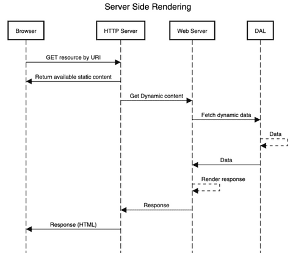
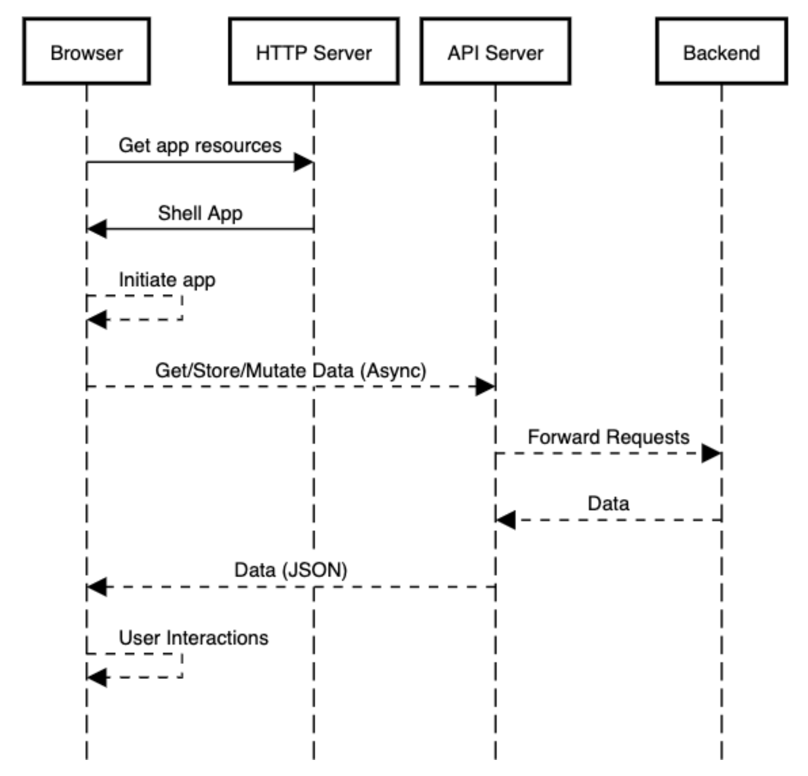

# Introduction to WebApps

#### WebApps in 2020

----

# Client-Server concepts

----

## Server Side Rendering

1. Browser asks for resource
2. Server prepares response based on URI and user data (session)
3. Server returns static content for the browser to render

---

## Server Side Rendering Flow



---

## Single Page Application

1. Browser asks for application files (shell)
2. Browser renders content
3. Application requests data from the server and re-renders accordingly
4. Interactions with the app can be delegated to the server or remain local

---

## Single Page Application Sequence



---

# REST

---

## REST - `Re`presentational `S`tate `T`ransfer

- Allow the access and manipulation of textual resources
- A uniform and predefined set of stateless operations
  - Stateless protocol: *HTTP*
  - Standard operations: *GET*, *HEAD*, *POST*, *PUT*, *PATCH*, *DELETE*, *CONNECT*, *OPTIONS* and *TRACE*
- Resource identification by URI

---

## RESTFul Example

URI: http://myserver.com/api/v1/`user`

- **GET** http://myserver.com/api/v1/`user`
- **GET** http://myserver.com/api/v1/`user`/user-id-123
- **POST** http://myserver.com/api/v1/`user`
- **PUT** http://myserver.com/api/v1/`user`/user-id-123
- **DELETE** http://myserver.com/api/v1/`user`/user-id-123

---

## OpenAPI Specification (AKA Swagger)

#### A framework to describe and use RESTful APIs

- YMAL / JSON definition file
- Generators
  - File -> Code
  - Existing API -> Schema
- Visual usage tool [pet store demo](https://petstore.swagger.io/)
  
---

Example definition

```yaml
openapi: "3.0.0"
info:
  version: 1.0.0
  title: Swagger Petstore
  license:
    name: MIT
servers:
  - url: http://petstore.swagger.io/v1
paths:
  /pets:
    get:
      summary: List all pets
      operationId: listPets
      tags:
        - pets
      parameters:
        - name: limit
          in: query
          description: How many items to return at one time (max 100)
          required: false
          schema:
            type: integer
            format: int32
      responses:
        '200':
          description: A paged array of pets
          headers:
            x-next:
              description: A link to the next page of responses
              schema:
                type: string
          content:
            application/json:    
              schema:
                $ref: "#/components/schemas/Pets"
        default:
          description: unexpected error
          content:
            application/json:
              schema:
                $ref: "#/components/schemas/Error"
    post:
      summary: Create a pet
      operationId: createPets
      tags:
        - pets
      responses:
        '201':
          description: Null response
        default:
          description: unexpected error
          content:
            application/json:
              schema:
                $ref: "#/components/schemas/Error"
  /pets/{petId}:
    get:
      summary: Info for a specific pet
      operationId: showPetById
      tags:
        - pets
      parameters:
        - name: petId
          in: path
          required: true
          description: The id of the pet to retrieve
          schema:
            type: string
      responses:
        '200':
          description: Expected response to a valid request
          content:
            application/json:
              schema:
                $ref: "#/components/schemas/Pet"
        default:
          description: unexpected error
          content:
            application/json:
              schema:
                $ref: "#/components/schemas/Error"
components:
  schemas:
    Pet:
      type: object
      required:
        - id
        - name
      properties:
        id:
          type: integer
          format: int64
        name:
          type: string
        tag:
          type: string
    Pets:
      type: array
      items:
        $ref: "#/components/schemas/Pet"
    Error:
      type: object
      required:
        - code
        - message
      properties:
        code:
          type: integer
          format: int32
        message:
          type: string


```


